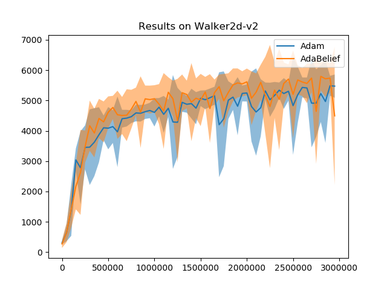

# Results of AdaBelief and Adam on Reinforcement Learning with SAC (Soft Actor Critic)

## Dependencies
* prfl
* gym
* torch

## How to run
```sh run_adabelief_walker2d.sh```
```sh run_adam_walkerd.sh```

You can change ```--env Walker2d-v2``` to ```--env HalfCheetah-v2``` for different tasks

## Results


