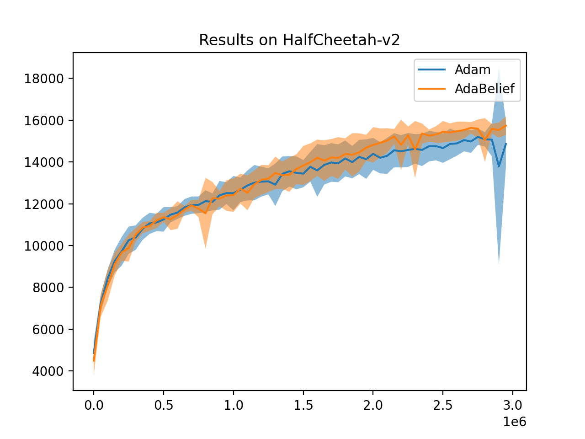

# Results of AdaBelief and Adam on Reinforcement Learning with SAC (Soft Actor Critic)

## Dependencies
* prfl
* gym
* torch

## How to run
```sh run_adabelief_walker2d.sh```
```sh run_adam_walkerd.sh```

You can change ```--env Walker2d-v2``` to ```--env HalfCheetah-v2``` for different tasks

## Hyper-parameters
```eps``` for AdaBelief is 1e-12, other parameters are default as in ```adabelief-pytorch==0.1.0```

|   Optimizer   |  lr | beta1 | beta2 | epsilon | weight_decay | weight_decouple | rectify     | fixed_decay | amsgrad |
|:--------:|-----|-------|-------|---------|--------------|-----------------|-------------|---------|---------|
| Adam    | 1e-3 | 0.9   | 0.999 | 1e-8    | 0.0        | -           | -      | -   | -   |
| AdaBelief    | 1e-3 | 0.9   | 0.999 | 1e-12    | 0.0        | True=False           | True     | False  | False   |

## Results


